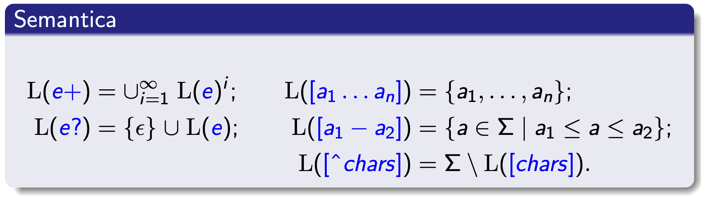

```table-of-contents
```
---

# Richiami di nozioni base dei linguaggi formali

![[02-01.png]]

## Sintassi delle espressioni regolari

![[02-02.png]]
![[02-04.png]]

## Semantica delle espressioni regolari

![[02-03.png]]
> Manca l'insieme vuoto.

![[02-05.png]]


---

# Classificazione dei token dei linguaggi di programmazione
- Parole chiave (keyword)
	- `if, then, else, while, ...`
	- Si usa l’alternanza: `if | then | else | while ...`
	- Unica categoria sintattica: KEYWORD
	- Case insensitive (e.g., SQL)
		- `select, SELECT, SeLeCt, SELect, ...`
		- Noioso e troppo verboso: si usano impostazioni ad hoc
- Identificatori
	- `[a-zA-Z_][0-9a-zA-Z_]*`
	- `[a-zA-Z_]([0-9] | [a-zA-Z_])*`
	- `DIGIT = [0-9] `
	- `LETTER = [a-zA-Z_]`
	- `{LETTER}({DIGIT}|{LETTER})*`
- Costanti letterali (intere, floating point, stringa, ecc.)
	- Costanti intere
		- `{DIGIT}+`
		- Nota: accetta `000000`, non accetta `-1`
	- Costanti floating point
		- `[+-]?[0-9]+.[0-9]*`
		- occorre distinguere iterazione positiva dal carattere `+` ?
	- Costanti carattere
		- `’[^’]’`
		- come specifichiamo la costante carattere `’` ?
- Operatori (matematici, logici, ecc.)
- Punteggiatura (parentesi, virgola, punto e virgola, ecc.)
	- ![[02-06.png]]
- Commenti (singola linea, multi linea)
	- Commento (singola linea) del C++
		- `//[^\n]*\n`
	- Commento (singola linea) di SQL
		- `--[^\n]*\n`
	- Commento multilinea (C / C++ / Java / SQL / ... )
		- `/\*([^*]|\*+[^/*])*\*+/`

---

## Risoluzione ambiguità
Più RE possono accettare (parti de-) lo stesso input.
Viene data la preferenza al lessema più lungo
- `forwhile` è un unico IDENT (non sono le due KEYWORD for e while)
- `>>` è un unico SHIFT RIGHT (non due GREATER THAN)

A parità di lunghezza si stabilisce un ordine di priorità tra le RE.

A volte queste regole possono creare situazioni noiose: 
Per lo standard C++03 e precedenti:
- corretto: `std::vector<std::list<int> >`
- errore (sintattico): `std::vector<std::list<int>>`
Per lo standard C++11 e successivi:
- corretto: `std::vector<std::list<int> >`
- corretto: `std::vector<std::list<int>>`

